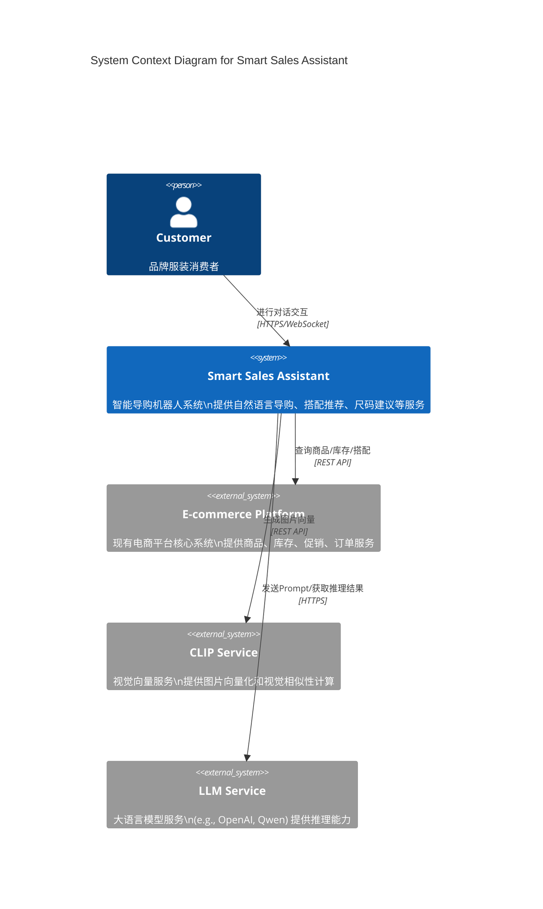
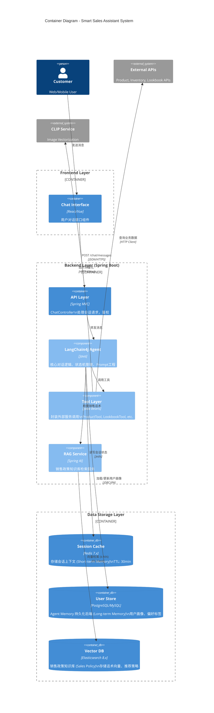
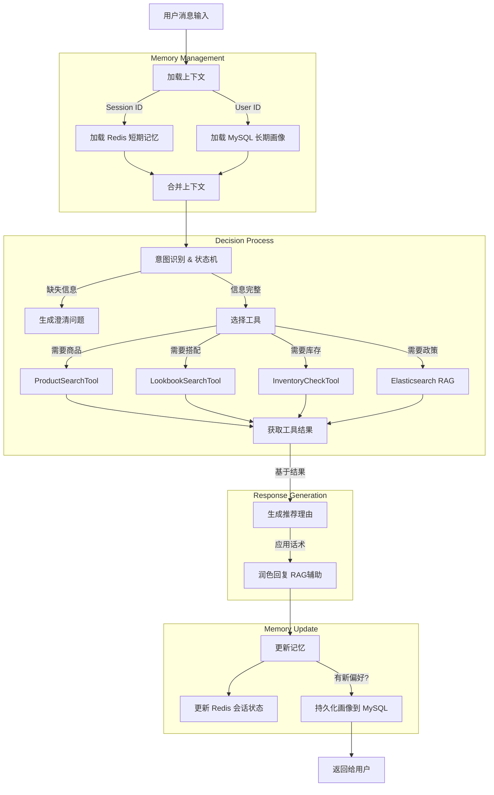

# System Architecture: Brand Clothing Intelligent Shopping Assistant Robot

**Feature**: Brand Clothing Intelligent Shopping Assistant Robot
**Branch**: `002-smart-sales-guide`
**Date**: 2026-01-06

本文档基于 `spec.md` 和 `plan.md` 绘制系统架构图，展示组件交互、数据流向及技术栈集成。

---

## 1. System Context Diagram (系统上下文)

展示智能导购机器人与用户及外部系统的宏观交互。

---

## 2. Container Architecture Diagram (容器架构)

展示系统内部核心容器、数据存储及详细技术选型。

---

## 3. Agent Internal Logic Flow (Agent 内部逻辑)

展示 LangChain4j Agent 处理一条用户消息的内部流程。

---

## 4. Data Flow & Storage Strategy (数据流与存储)

| 数据类型 | 存储组件 | 持久化策略 | 访问方式 |
|---------|---------|-----------|---------|
| **会话上下文** (Context) | Redis | **短期** (TTL 30min) | 会话 ID 索引，Agent 自动加载 |
| **用户画像** (User Profile) | MySQL/PG | **长期** (持久化) | 用户 ID 索引，LangChain4j Memory Backend |
| **销售政策** (Sales Policy) | Elasticsearch | **长期** (知识库) | 向量检索 (k-NN)，Agent RAG 调用 |
| **商品数据** (Product) | 外部系统 | **不存储** (实时查询) | ProductSearchTool 封装 API 调用 |
| **搭配数据** (Lookbook) | 外部系统 | **不存储** (实时查询) | LookbookSearchTool 封装 API 调用 |
| **图片向量** (Image Vec) | 内存/临时 | **不存储** (实时计算) | CLIP Service 计算，仅用于单次检索 |

